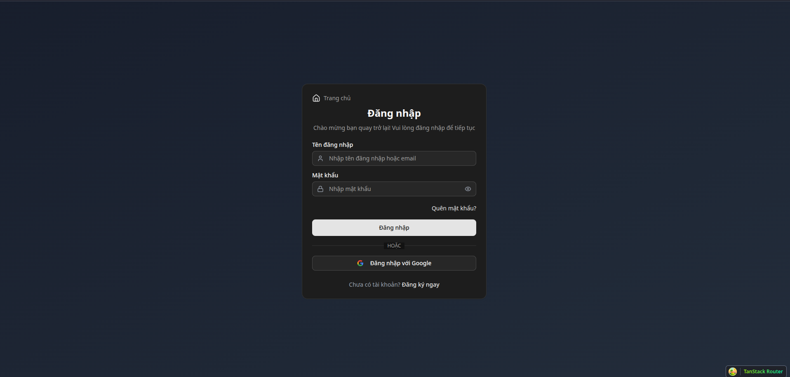
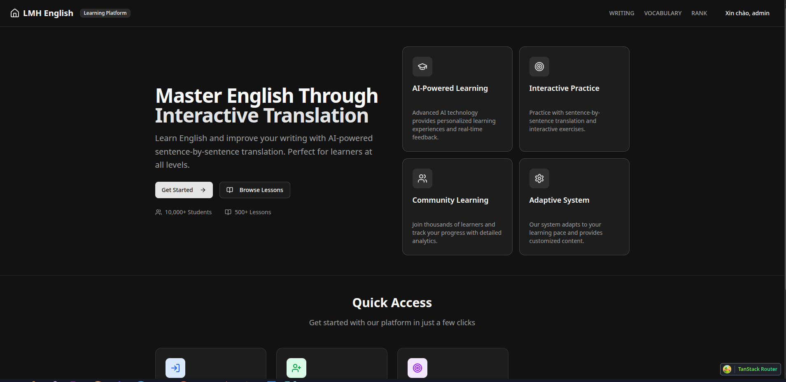
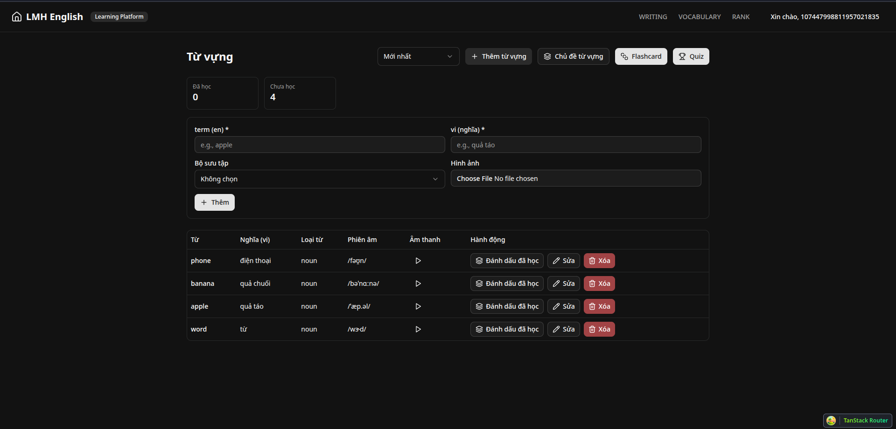
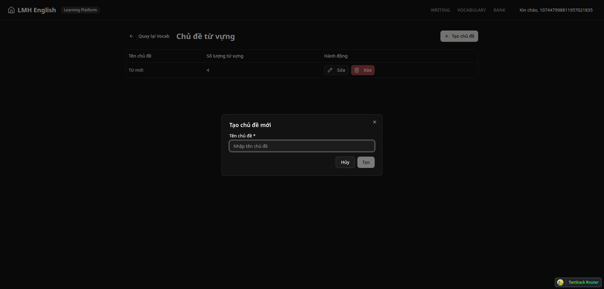
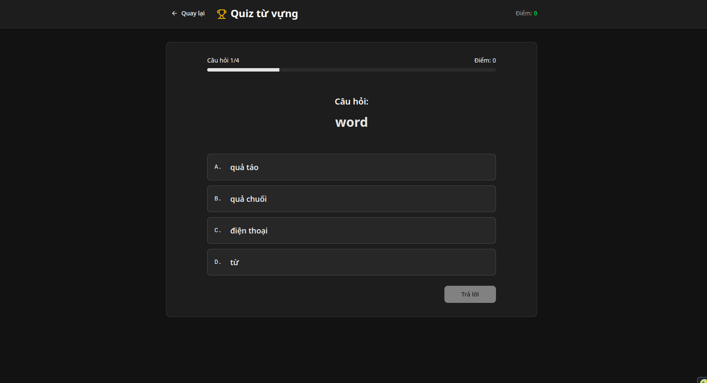
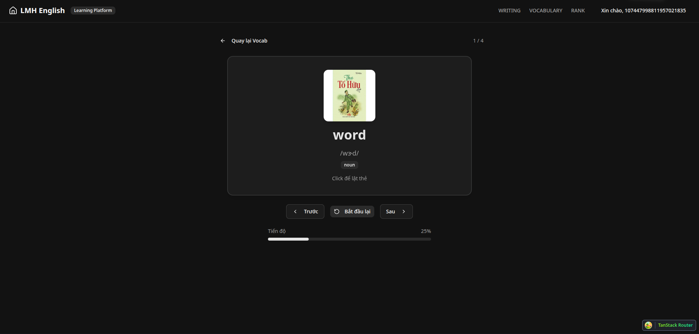

# LMH – Nền tảng học tiếng Anh qua dịch câu tương tác (AI-Powered)

**LMH (Learn My Habit)** là ứng dụng web học tiếng Anh theo phương pháp **dịch câu tương tác**, kết hợp **AI (Google Gemini)** để **đánh giá & gợi ý câu trả lời** trong ngữ cảnh bài học.  
Dự án được phát triển **full-stack** với **Spring Boot + React + PostgreSQL + Redis** nhằm mang lại trải nghiệm học tập tự nhiên, hiệu quả và thông minh.

---

## 🚀 Demo













---

## 🧠 Tính năng nổi bật

- 👤 **Người dùng:** đăng ký, đăng nhập, xác thực email, quên mật khẩu, Google OAuth2  
- 📚 **Học tập:** lesson theo cấp độ/chủ đề, quiz từ vựng, tính điểm, lưu tiến độ  
- 🤖 **AI hỗ trợ:** tích hợp **Google Gemini** để chấm & gợi ý câu trả lời theo ngữ cảnh  
- 🛠️ **Quản trị:** CRUD bài học, chủ đề, người dùng, thống kê học tập  
- 🔐 **Bảo mật:** JWT, OAuth2, Redis sessions, CORS, HTTPS-ready  

---
## Cấu trúc thư mục rút gọn
```
LMH/
├── backend/
│ ├── docker-compose.yaml # PostgreSQL & Redis cho môi trường phát triển
│ └── lmh.web/ # Spring Boot Application (Backend)
│ ├── pom.xml # Cấu hình Maven & dependencies
│ └── src/
│ ├── main/java/com/... # Code nguồn (Controller, Service, Repository)
│ └── main/resources/
│ ├── application.yml # Cấu hình (DB, Redis, Mail, JWT,...)
│ └── db/changelog/ # Quản lý migration bằng Liquibase
│
├── frontend/
│ ├── package.json # Scripts & dependencies cho React/Vite
│ └── src/
│ ├── routes/ # Routing (landing, auth, user, admin,...)
│ ├── features/ # Module tính năng (quiz, profile, admin,...)
│ ├── api/ # API clients (auth, quiz, lesson, gemini,...)
│ ├── components/ # UI components (shadcn/radix-based)
│ └── assets/ # Hình ảnh, icon, style, config UI
│
└── image/ # Ảnh minh họa giao diện dùng trong README
```
---
## ⚙️ Công nghệ chính

**Backend (Java 17 – Spring Boot 3.5)**  
- Spring Security (JWT + OAuth2 Google)  
- PostgreSQL + Redis Cache  
- Liquibase Migration  
- REST API, MapStruct, Mail, Validation  

**Frontend (React 19 + TypeScript + Vite 6)**  
- TanStack Router + React Query  
- Tailwind CSS 4 + shadcn/ui + Radix UI  
- React Hook Form + Zod Validation  

